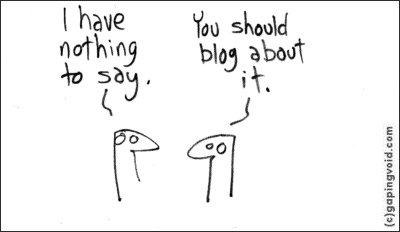

As my sophomore year of college wound down, I’ve finally gotten some time to reorganize my website a bit and try to start this blog that I’ve been thinking of starting for around half a year now. Over the course of that time, I came up with a few good topics I may want to write about but also some that I decided to scratch out immediately. That being said, if you were to ask me exactly what this blog will be about, I don’t have a direct answer. But for now, assuming I do have time in the future to somewhat regularly update this blog (hopefully), let’s just say my posts will possibly be a mix of personal anecdotes, things I learn from my projects & other people, tech, and book reviews. (Yeah, I guess I’m just going to write about whatever I find intriguing).

Ultimately, what’s important to me lies less in what the content actually is but more on how I can, through writing, organize and formulate my exact opinions and convey my ideas with clarity. After all, other than maybe the occasional typos that I get made fun of, there really is no downside for me in starting this blog. 

In the long run, I am counting on this blog to act as some sort of mental checkpoint for me and serve as an outlet for me to take a step back, be a little more reflective & introspective, and document my thought process every once in awhile. Optimistically, along the way I even learn to become both a better writer and a better thinker! 

Furthermore, as I’m not too frequent of a social media user right now, I do think having this blog can potentially serve as a subtler, more low-key medium for my friends afar and others interested in my life -- not that I really expect anyone to be haha -- to get a glimpse of my thought process and who I am. 

07/01/2019

    
    <em>Image Source: stageoflife.com</em>

