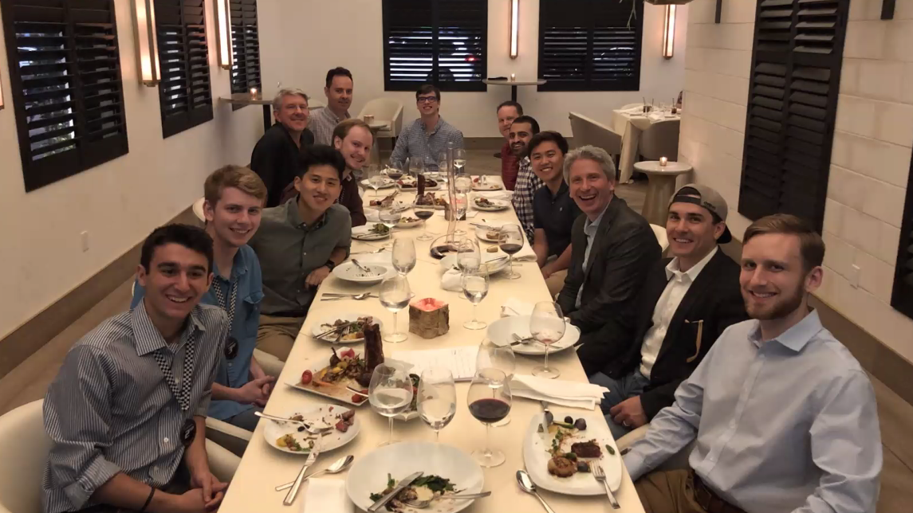

<figure>
  
</figure>

### Initial Thoughts
Company culture -- it’s a phrase I often see getting thrown around when I’m reading the news or books describing, well, companies. As much as I’ve read about it, I never really knew what it exactly means. To be fair, a college student like me simply haven’t had much opportunity to be in any company to really know. Luckily, this summer (2019), I had the chance to work as a Software Engineering Intern at a tech consultant company based in Houston, Texas -  [Expero Inc.](https://www.experoinc.com/) 

Within my first few days of working, I was very quickly blown away by how talented people here are. Perhaps a week or two into the program, I began to wonder: how did Expero, a relatively-small sized company, pull together all these brilliant people?  Or in other words, what is it about Expero that excites all these people and has made them stay here so happily? In my 10 weeks here, I think I’ve gotten an answer to my questions about Expero and also come to grasp what company culture really means.

  

### Expero’s Culture
Beyond the exciting range of projects, awesome selection of office snacks, and lovely office view by the Buffalo Bayou, I quickly realized that it’s something else that truly drives a company. At Expero, it seems like not only is everyone very engaged in his or her own project, but everyone is also always excited and intrigued about other’s projects as well. This unique trait promotes a culture where projects aren’t just projects for clients but something the company as a whole appreciates and finds value in. 

People here are also always willing to take the extra mile to help others even if they’re not on the same team. For instance, there was one time when I was completely blocked by a weird bug. After exhausting all the options that I know of and StackOverflow suggests, I decided to take a tour around the office, peeking and poking at full-time developers. Sadly, no one seemed to know a quick fix, but through Slack, one developer did point me to an engineer working in another office that may know the solution.

Long story short: I introduced myself to him on Slack, explained my issue, and in no time, he hopped onto a video call and helped me solved my issue. My anecdote is only one of many times that I’ve first-hand seen or experienced people at Expero help someone else in the company even if the issue is not directly related to them.

Don’t get me wrong though. I'm not trying to kiss up to the company or anything. As much as I loved Expero's culture, it isn't perfect. One con that I believe exists is how lenient the company is on employees working from home. To employees, I know working from home sounds like the dream (I myself WFH a few days and loved it). However, this convenience also meant that sometimes very few people are at the office simultaneously. As driven and friendly people are at Expero, a face-to-face interaction always beat a Slack message. No?
  

### Final Takeaway
The point of this piece isn’t to kiss up, criticize, or analyze Expero’s culture extensively. After all, I’ve only done two internships so, yes, who am I to comment so much? All I’m relaying is that working at Expero for 10 weeks has taught me more than just technical skills.

One of my biggest takeaways from the internship is that **people** of all things is the most important factor in a company. It is true what they say:

> Culture makes or breaks your business. 

In Expero’s case, its passionate and friendly culture certainly make up a huge portion of its success and I’m lucky to have worked there. I am excited to see how, as my career develops and changes, I can experience and find out how company culture plays into other companies' success. 

<figure>
  
</figure>

