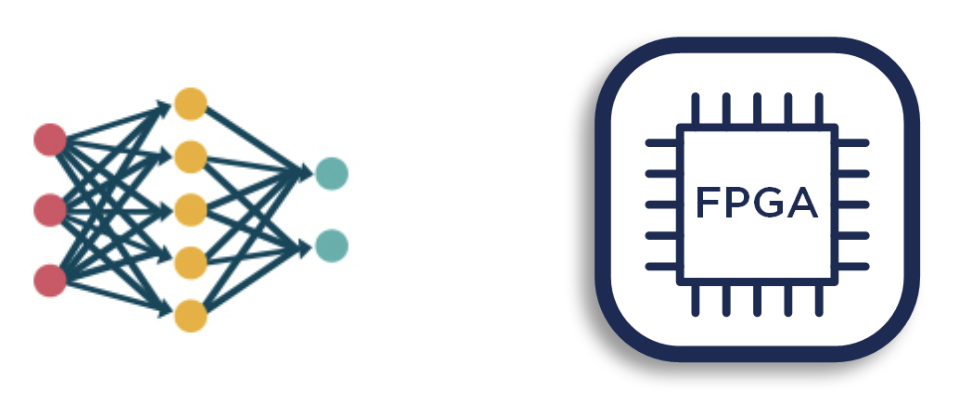

  

## Edge ML on FPGA
In addition to the [great company experience](../2.companyculture/) I had at [Expero Inc.](https://www.experoinc.com/), I also got to work on a cool, futuristic project called Edge Machine Learning on FPGA (Field Programmable Gate Array).

A quick summary of the motivation behind this project: Most ML models today are run on software like modern computers, but if we run ML inference on a piece of hardware, like the FPGA, can we potentially immensely increase throughput & speed? Furthermore, if inference can be achieved on hardware solely, can we eliminate issues such as data breaches as no data needs to be passed through some host server or proxy?

My work at Expero is then to spearhead the investigation and research into this technology that few in industry has tapped into. I was super lucky to get put on this project as it presented me an opportunity to explore 3 different facets of computer science used in industry: machine learning, data engineering, and hardware implementations.

### Going Back To the Basics: Training a Neural Network
In my first three-ish weeks, I worked on .

### Detailing the Process: Building a Data Pipeline

### Refining the Details: Testing Hardware ML

